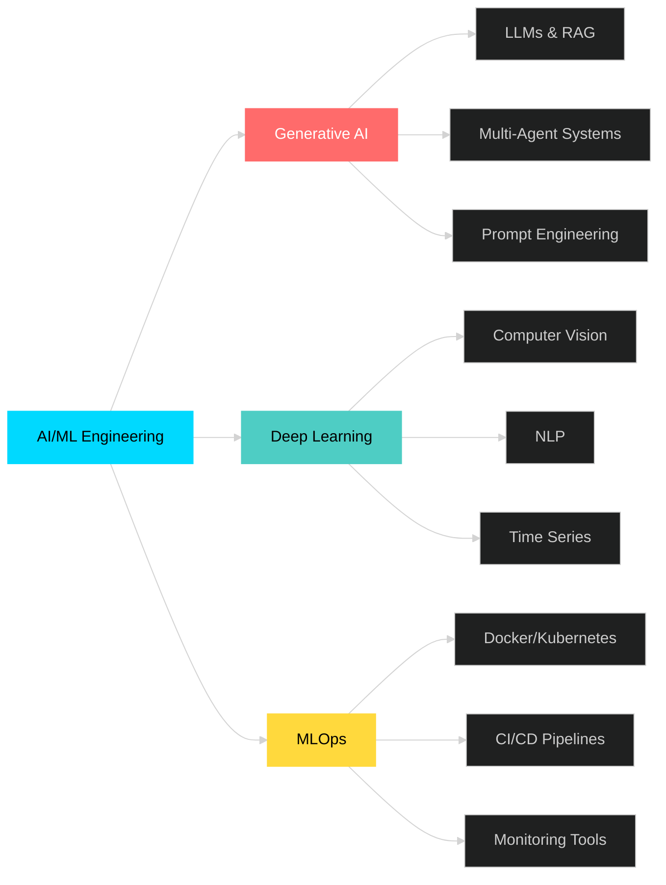

<div align="center">

<!-- Animated Header with Gradient -->


</div>

<div align="center">
  
[](https://git.io/typing-svg)

</div>

---

<div align="center">

### 🌐 **Connect With Me**

[](https://linkedin.com/in/ayush-dubey-69860522a)
[](https://melodious-melomakarona-7fef9e.netlify.app/)
[](mailto:aadubey1106@gmail.com)
[](https://github.com/MLayush-dubey)

**📍 Abu Dhabi, UAE** • **📱 +971 50 878 5663** • **🚀 Available Immediately**

</div>

---

## 🎯 **About Me**

```python
class AyushDubey:
    def __init__(self):
        self.role = "AI/ML Engineer"
        self.location = "Abu Dhabi, UAE 🇦🇪"
        self.expertise = [
            "Generative AI (LLMs, RAG, Agents)",
            "Deep Learning & Computer Vision",
            "MLOps & Production Deployment",
            "Full-Stack AI Applications"
        ]
        self.current_focus = "Building scalable agentic AI systems"
        self.achievement = "30% cost reduction via optimized ML pipelines"
        
    def say_hi(self):
        print("Thanks for dropping by! Let's build something amazing together!")

me = AyushDubey()
me.say_hi()
```

<details>
<summary><b>🔥 What Sets Me Apart</b></summary>
<br>

- 🎯 **Production-First Mindset**: 10+ deployed models in real-world applications
- 💡 **Cost Optimizer**: Achieved 30% cost reductions through intelligent architecture
- 🤖 **Agentic AI Expert**: Built multi-agent systems with CrewAI, LangChain & LlamaIndex
- 🚀 **Full-Stack Capability**: From model training to containerized deployment
- 📊 **Proven Track Record**: B.Tech AIML (8.20 GPA) + Multiple Production Systems

</details>

---

## 🛠️ **Technology Arsenal**

<div align="center">

### **Core AI/ML Stack**


### **Generative AI & LLMs**


### **Vector Databases & RAG**


### **MLOps & Deployment**


### **Backend & APIs**


### **Frontend & UI**


</div>

---

## 💼 **Professional Experience Highlights**

<table>
<tr>
<td width="50%">

### 🏢 **Samarth Life Sciences**
**Fullstack AI Engineer** • *Sept-Oct 2025*

- 📊 Built predictive analytics dashboard (6-month sales trends)
- 🤖 Engineered custom RAG chatbot for pharmaceutical catalogs
- 📈 Implemented time-series forecasting for inventory planning

</td>
<td width="50%">

### 🏗️ **Bhairav Builders**
**AI Consultant** • *Oct 2024-Jan 2025*

- ⚛️ Developed modular React TypeScript website (20% faster dev)
- 🎯 Streamlined GenAI workflows (ChatGPT/Claude)
- 👥 Trained 10+ sales professionals (100% adoption)

</td>
</tr>
<tr>
<td width="50%">

### 🎨 **Arkham Archives**
**AI Developer** • *Dec 2023-June 2024*

- 🎬 Built GAN-based image-to-video generation system
- 🔄 Designed preprocessing pipelines for enhanced output
- 🤝 Led multidisciplinary team collaboration

</td>
<td width="50%">

### 📊 **IntellAI**
**Data Scientist** • *June 2023-Feb 2024*

- 🌐 Built scalable Django web applications
- 🔌 Created 15+ RESTful API endpoints (40% testing reduction)
- ✅ Executed 100+ automated test cases (Postman)

</td>
</tr>
</table>

---

## 🚀 **Featured Projects**

<div align="center">

### **🔬 RAG Agentic Research Chatbot**
[](https://github.com/MLayush-dubey/RAG-Agentic-Research-Chatbot)

</div>

```
🎯 Production-grade RAG system with multi-agent architecture
├─ ⚡ Sub-second retrieval using LlamaIndex + ChromaDB
├─ 🐳 Containerized microservices (Docker + FastAPI + Streamlit)
├─ 🤖 Multi-agent orchestration with CrewAI
├─ 🦙 Groq Llama 3.1 inference for scalable deployment
└─ ✅ Pydantic validation for conversational context management
```

**Tech Stack**: LlamaIndex • ChromaDB • FastAPI • Streamlit • CrewAI • Docker • Groq

---

<div align="center">

### **📈 Stock Market Dual Agent System**
[](https://github.com/MLayush-dubey/StockMarket-multi-agents)

</div>

```
🎯 Multi-agent AI system for automated equity research
├─ 👔 Analyst Agent: Analyzes 15+ financial metrics
├─ 📊 Trader Agent: Generates actionable trading strategies
├─ 📉 Real-time data integration (Yahoo Finance API)
├─ 🔄 90% reduction in manual analysis time
└─ 🎲 100% reproducible trading recommendations
```

**Tech Stack**: Multi-Agent AI • Yahoo Finance API • LLMs • Custom Financial Tools

---

<div align="center">

### **🍕 Food Vision - Deep Learning Classification**
[](https://github.com/MLayush-dubey)

</div>

```
🎯 CNN system beating DeepFood benchmark on Food101 dataset
├─ 🎯 85% accuracy (vs DeepFood's 77.4%)
├─ ⚡ 90-minute training (vs 3 days) using Mixed Precision
├─ 🧠 EfficientNetB1 with 40% memory reduction
├─ 🚀 Real-time Streamlit deployment with Top-5 predictions
└─ 📊 Optimized pipeline with adaptive learning rates
```

**Tech Stack**: TensorFlow/Keras • EfficientNetB1 • Streamlit • Mixed Precision Training

---

## 📊 **GitHub Statistics**

<div align="center">


</div>

<div align="center">


</div>

---

## 🏆 **Certifications & Education**

<table>
<tr>
<td width="50%">

### 🎓 **Education**
**B.Tech in AI & Machine Learning**  
*Thakur College of Engineering*  
📊 GPA: **8.20/10**  
📅 May 2021 - June 2025

</td>
<td width="50%">

### 📜 **Certifications**
- ✅ Complete Generative AI Course: RAG, AI Agents & Deployment *(Udemy, 2025)*
- ✅ Python Training *(IIT Bombay, 2022)*

</td>
</tr>
</table>

---

## 📈 **Skill Proficiency Matrix**



---

## 💡 **Current Focus Areas**

<div align="center">

| 🎯 Area | 📊 Status | 🔥 Intensity |
|---------|-----------|--------------|
| **Agentic AI Systems** | Building production systems | 🟢🟢🟢🟢🟢 |
| **RAG Optimization** | Advanced retrieval techniques | 🟢🟢🟢🟢⚪ |
| **MLOps at Scale** | Kubernetes orchestration | 🟢🟢🟢🟢⚪ |
| **LLM Fine-tuning** | Domain-specific models | 🟢🟢🟢⚪⚪ |

</div>

---

## 🤝 **Let's Collaborate!**

<div align="center">

I'm passionate about building **production-grade AI systems** that solve real-world problems.  
Currently seeking opportunities to work on **cutting-edge AI/ML projects**.

### **Open to:**
✨ Full-time AI/ML Engineering roles  
🚀 Generative AI & Agentic Systems projects  
💼 Consulting on RAG pipelines & LLM deployment  
🤖 Open-source collaborations

<br>

### **📬 Get in Touch**

[](https://linkedin.com/in/ayush-dubey-69860522a)
[](mailto:aadubey1106@gmail.com)

</div>

---

<div align="center">

### 💭 **Random Dev Quote**


---

### 👀 **Profile Views**


---


**⭐ If you find my work interesting, consider starring my repositories!**

</div>
